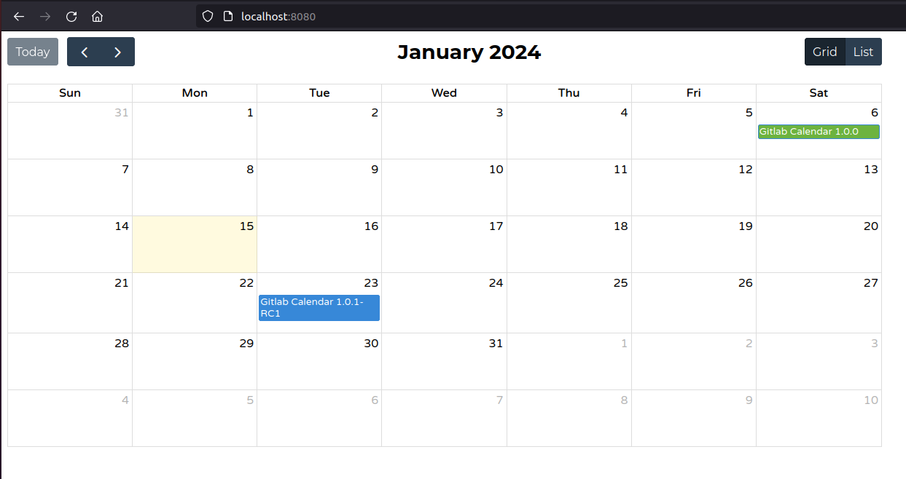

# GitLab Calendar

The **GitLab Calendar** project provides a calendar containing release dates for projects on self-managed GitLab. This version is a modification of the open-source project [spring calendar](https://github.com/spring-io/spring-calendar/tree/main), extending support to GitLab as well.

## Installation

The project is developed using Spring Boot 3.3.0, Java 22 and Gradle 8.8.

### Prerequisites
- JDK 22
- GitLab account with a user (bot) and a token for authentication.

### Installation Steps
1. Clone the repository: `git clone https://github.com/ftabino/gitlab-calendar.git`
2. Modify the `application.yml` file with the following configurations:
   ```yaml
   calendar:
     gitlab:
       url: <GITLAB_URL>
       token: <GITLAB_TOKEN>
   ```

## Usage

To start the project, run the Gradle command:
```bash
./gradlew bootRun
```

Upon the first run, the project will automatically retrieve all milestones from projects where the bot user is a member.



